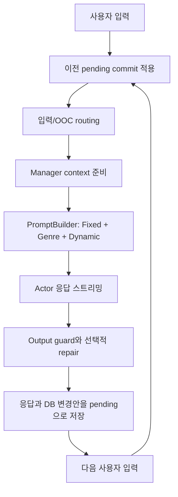

---
aliases:
  - Graph Engine Architecture
tags:
  - architecture
  - graphrag
---

# GraphRAG

GraphRAG는 Kuzu 그래프를 상태의 원본으로 사용하는 기존 역할극 시뮬레이션 엔진이다. [[Home]]에서 WikiRAG와의 전체 비교를 볼 수 있다.

## 세부 문서

- [[GraphRAG/Turn Pipeline|턴 파이프라인]] — 입력부터 다음 턴 commit까지
- [[GraphRAG/Storage|저장소와 transaction]] — Kuzu, JSON metadata, 격리와 잠금
- [[GraphRAG/Prompt and Simulation|프롬프트와 시뮬레이션]] — Manager context, PromptBuilder, accepted-response updater
- [[Shared/Runtime|공용 런타임]] — WikiRAG와 함께 사용하는 FastAPI·Actor·Sites 계층
- [[Shared/Boundaries|엔진 경계]] — Graph와 Wiki가 섞이지 않아야 하는 지점

## 책임과 경계

- FastAPI 채팅 백엔드: `src/apps/app/`
- 브라우저 UI: `frontend/app/`, Sites UI `hosted-ui/`
- 그래프 저장소와 transaction: `src/core/database/`
- 턴 준비와 컨텍스트 선택: `src/agents/manager/`, `src/agents/context/`
- 프롬프트 조립: `src/agents/prompt_factory/`
- Actor 스트리밍: `src/apps/app/actor.py`, `src/agents/actor.py`
- 수락된 응답의 상태 반영: `src/simulation/state/`, `src/simulation/systems/`
- 월드 정적 자산: `src/assets/worlds/<world_id>/`

GraphRAG 전용 모듈은 [[WikiRAG]]의 Markdown 상태를 직접 수정하지 않는다.

## 상태 모델

각 대화는 독립된 Kuzu DB를 사용한다. 캐릭터, 장소, 관계, 사건, 기억, 욕구, 일정, 목표, 아이템, 비밀이 노드와 관계로 저장된다.

```text
data/threads/<thread_id>/schema/
data/threads/<thread_id>.json
data/worlds/graph/<world_id>/usernotes.json
```

- standalone FastAPI 대화의 Kuzu 경로는 `src/apps/app/runtime.py`의 `conversation_db_path()`가 결정한다.
- Kuzu는 별도 서버 없이 프로세스 안에서 실행된다.
- 여러 쓰기는 `async_driver.transaction()`으로 묶는다.
- transaction lock은 재진입할 수 없다.
- thread와 world 범위를 넘는 조회나 쓰기를 허용하지 않는다.

## 턴 수명주기



핵심 불변식은 Actor 생성 도중 Kuzu에 응답 파생 상태를 쓰지 않는 것이다. 최신 응답을 reroll하거나 삭제할 때 아직 수락되지 않은 부작용을 폐기할 수 있어야 한다.

## 프롬프트 계약

| 구간 | GraphRAG 입력 | 안정성 |
| --- | --- | --- |
| Fixed | 정책, 월드, 정적 캐릭터 지식 | 턴 사이에서 안정적으로 유지 |
| Genre | 장면 종류별 문체 규칙과 예시 | 장면 분류가 바뀌면 변경 가능 |
| Dynamic | 시각, 장소, 그래프 컨텍스트, 사용자 입력 | 매 턴 재구성 |

현재 시각, 위치, 최근 사건, 관계 수치, 욕구, 일정, 기억, 사용자 입력을 Fixed에 넣지 않는다. 이는 사실성뿐 아니라 모델 prompt cache 안정성을 위한 경계다.

## 수락 이후 상태 반영

다음 턴이 시작되면 이전 Actor 응답을 기준으로 다음 작업을 수행한다.

- 헤더 시각과 장소 반영
- literal/figurative 구분과 신체 상태 추출
- 다중 캐릭터 상태와 관계 변화
- 사건과 기억 생성
- 목표, 아이템, 비밀 변화
- 욕구, 일정, 자율 행동, 사회 시스템 처리
- 기억 감쇠·왜곡·압축

장기 시스템은 호출자가 결과를 반드시 요구하지 않는 한 best-effort로 동작한다.

## 현재 강점과 비용

### 강점

- 구조화된 관계와 상태를 세밀하게 조회할 수 있다.
- 결정적 규칙과 장기 시뮬레이션 시스템이 풍부하다.
- Graph Viewer와 기존 World Editor 자산을 활용할 수 있다.

### 비용

- 상태 종류가 많아 updater 호출과 유지보수 경로가 복잡하다.
- 스키마 변경과 데이터 이행 비용이 크다.
- 사용자가 세계 상태를 직접 읽고 고치기 어렵다.

GraphRAG의 유지보수 작업은 [[TODO#GraphRAG 유지보수]]에서 관리한다.
