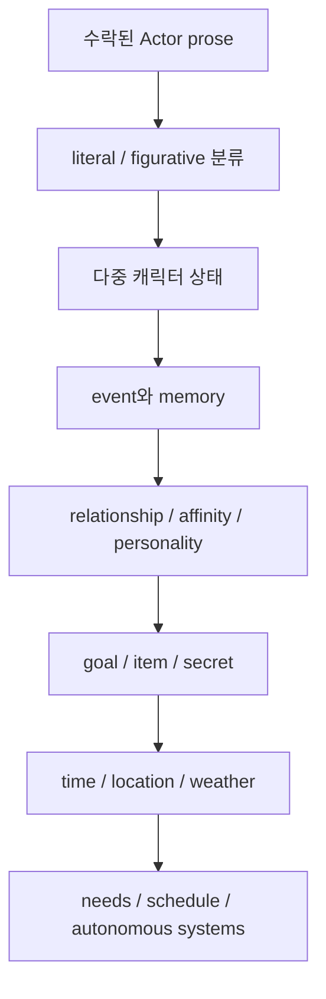

---
aliases:
  - GraphRAG Prompt and Simulation
tags:
  - architecture
  - graphrag
  - prompt
  - simulation
---

# GraphRAG 프롬프트와 시뮬레이션

## PromptBuilder 입력

Graph Manager가 Kuzu에서 필요한 부분만 조회하고 renderer가 Actor용 Markdown context로 바꾼다.

| 구간 | 주요 내용 | 변경 주기 |
| --- | --- | --- |
| Fixed | 정책, 세계관, 정적 인물 지식, POV | world/설정 변경 시 |
| Genre | 장면 종류별 묘사 규칙, few-shot | scene type 변경 시 |
| Dynamic | 헤더, 현재 시각·장소, 상태·기억·관계, 사용자 입력 | 매 턴 |

## Context 선택

- core: 주연 캐릭터, 관계, 사건, 기억
- dynamic systems: 목표, 아이템, 비밀, 사회 context
- scene/transient: 현재 위치, 참여자, 직전 장면
- user controls: usernote, OOC, POV 선택

모든 graph 사실을 매 턴 넣지 않는다. planner가 장면에 필요한 context를 선택해 token 비용과 노이즈를 제한한다.

## Accepted-response updater

## 상태 변경 원칙

- 비유 표현을 실제 부상으로 기록하지 않는다.
- 일상적 친절과 반복적 친밀감에 큰 관계 delta를 주지 않는다.
- 장기 서사 가치가 없는 routine moment를 persistent event로 만들지 않는다.
- secret의 private summary를 Actor에게 직접 노출하지 않는다.
- memory distortion은 의도된 주관성이다.

## WikiRAG와의 차이

GraphRAG와 WikiRAG는 모두 공용 mode-aware accepted-turn Updater를 호출한다.
Graph mode는 이 다단계 simulation 반영기를 실행하고, Wiki mode는 Kuzu를 열지
않은 채 Wiki commit planner가 문서 section 변경안을 제안한다. 필요한 결정적
시스템은 실제 플레이 결과를 근거로 공용 Updater의 mode 계약 안에서 선택적으로
복원한다.
