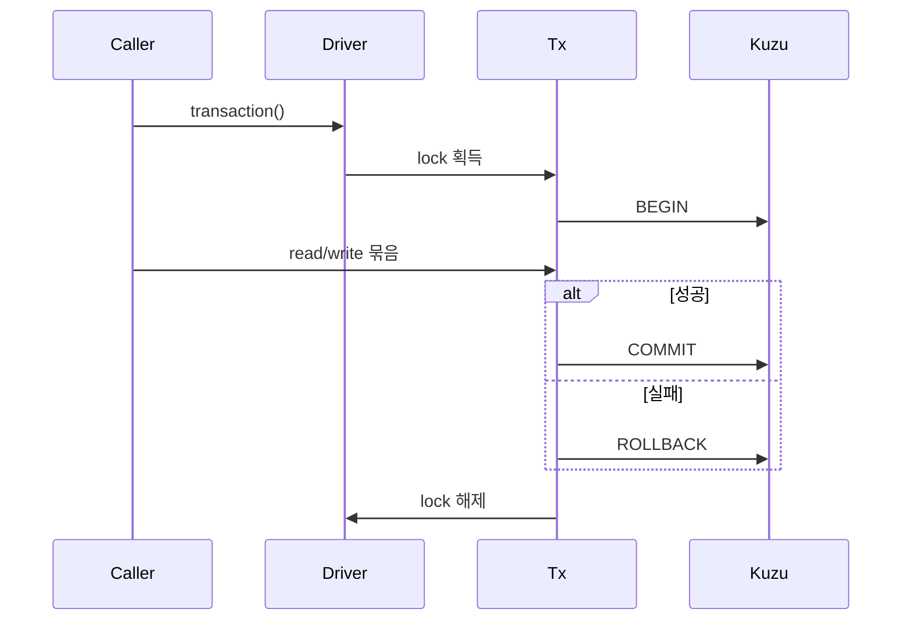

---
aliases:
  - GraphRAG Storage
tags:
  - architecture
  - graphrag
  - database
---

# GraphRAG 저장소와 transaction

## 저장 단위

| 데이터 | 저장 위치 | 소유자 |
| --- | --- | --- |
| standalone thread graph | `data/threads/<thread_id>/schema/` | Kuzu driver |
| 대화 메시지와 UI 상태 | `data/threads/<thread_id>.json` | ConversationStore |
| Graph world usernote | `data/worlds/graph/<world_id>/usernotes.json` | ConversationStore |
| prompt/turn debug | `logs/turn_debug/<timestamp>/` | turn debug writer |

## Driver 계층

- `KuzuAsyncDriver`: thread DB 연결과 비동기 facade
- `ProxyDriver`: 현재 활성 driver를 context에 따라 위임
- `KuzuSession`: 단일 query lock
- `KuzuTransaction`: BEGIN부터 COMMIT/ROLLBACK까지 lock 유지

## transaction 규칙

- transaction lock은 재진입할 수 없다.
- transaction 안에서 새 session이나 transaction helper를 열지 않는다.
- embedding과 LLM 같은 느린 작업은 lock을 잡기 전에 계산한다.
- read-modify-write는 하나의 transaction으로 묶어 lost update를 방지한다.

## schema lifecycle

- world table 정의는 `src/assets/worlds/base.py`와 각 world schema에 있다.
- 초기화는 `schema_builder`가 담당하며 대상 graph를 삭제하고 다시 만든다.
- migration은 introspection과 `SchemaMigration` ledger를 사용한다.
- memory처럼 주관적인 데이터는 객관 기록으로 교정하지 않는다.

## 격리 불변식

- thread A의 driver로 thread B를 조회하지 않는다.
- world ID가 같아도 Wiki mode usernote와 공유하지 않는다.
- UI metadata JSON을 Kuzu 상태의 대체 원본으로 사용하지 않는다.
- Graph Viewer snapshot은 조회·표시용이며 canonical graph가 아니다.

