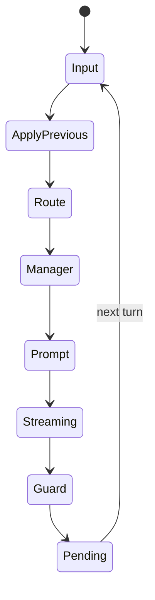

---
aliases:
  - GraphRAG Turn Pipeline
tags:
  - architecture
  - graphrag
  - turn
---

# GraphRAG 턴 파이프라인

## 진입점

`src/apps/app/service.py::append_user_and_stream`이 standalone chat의 Graph 턴을 조율한다.

## 단계별 흐름

1. ConversationState와 mode를 확인한다.
2. `ActiveConversation`이 thread 전용 Kuzu driver를 활성화한다.
3. 이전 Actor 응답의 pending write를 commit한다.
4. 명령어, 빈 입력, OOC-only 입력을 routing한다.
5. Manager가 시각·장소·캐릭터·관련 context를 준비한다.
6. PromptBuilder가 세 prompt 구간을 만든다.
7. Actor가 응답을 streaming한다.
8. output guard가 visible prose를 검사하고 필요하면 repair한다.
9. 응답, snapshot, 적용 예정 효과를 pending으로 저장한다.
10. 다음 사용자 입력에서 3단계로 돌아가 이전 응답을 수락한다.

## Manager의 하위 단계

| 단계 | 대표 위치 | 결과 |
| --- | --- | --- |
| bootstrap | `manager/planning.py` | world/global state |
| scene classification | `manager/classifier.py` | daily, emotional 등 |
| context plan | `manager/integrated_planner.py` 또는 `context/planner.py` | 조회 대상 |
| core context | `manager/core_context.py` | character, memory, event, relation |
| world context | `manager/world_context.py` | goal, item, secret, social |

Manager는 prompt 준비 계층이며 accepted Actor prose의 시간 전진을 직접 확정하지 않는다.

## 실패 경계

- Actor streaming 실패: Kuzu response side effect 없음.
- output repair 실패: 응답을 확정하지 않음.
- updater의 best-effort 하위 시스템 실패: 핵심 commit과 분리해 기록하고 가능한 경우 계속 진행.
- transaction 실패: 전체 write 묶음을 rollback.

## reroll 의미

- 최신 미커밋 응답: pending을 폐기하고 이전 snapshot에서 다시 생성한다.
- 이미 commit된 과거 응답: 텍스트 variant를 만들 수 있으나 현재 그래프를 과거로 자동 복원하지 않는다.

저장과 잠금은 [[GraphRAG/Storage|GraphRAG 저장소와 transaction]]에서 다룬다.

