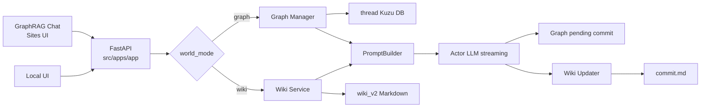

---
aliases:
  - GraphRAG Architecture Wiki
tags:
  - architecture
  - index
---

# GraphRAG Architecture Wiki

이 폴더는 `graphRAG/wiki` 브랜치의 **개발 아키텍처를 기록하는 별도 Obsidian vault**다.

> [!important] WikiRAG와의 경계
> 이 문서 vault는 설계와 개발 진행 상황을 사람이 읽기 위한 기록장이다.  
> `wiki_v2/`의 월드·시나리오·thread Markdown과는 별개이며 Actor 프롬프트, Wiki Updater, `commit.md` 처리에 참여하지 않는다.

## 문서 지도

### 공용 계층

- [[Shared/Runtime|공용 런타임]] — FastAPI, Sites, 대화 저장, Actor streaming
- [[Shared/Boundaries|엔진 경계]] — 공유 가능한 것과 절대 공유하지 않는 상태

### GraphRAG

- [[GraphRAG]] — Kuzu 그래프 엔진 포털
- [[GraphRAG/Turn Pipeline|GraphRAG 턴 파이프라인]]
- [[GraphRAG/Storage|GraphRAG 저장소와 transaction]]
- [[GraphRAG/Prompt and Simulation|GraphRAG 프롬프트와 시뮬레이션]]

### WikiRAG

- [[WikiRAG]] — Markdown 원본 엔진 포털
- [[WikiRAG/Vault Model|WikiRAG vault와 문서 모델]]
- [[WikiRAG/Turn Pipeline|WikiRAG 턴 파이프라인]]
- [[WikiRAG/Prompt Pipeline|WikiRAG 프롬프트 파이프라인]]
- [[WikiRAG/Commit and Conflicts|WikiRAG 커밋과 충돌 처리]]

### 운영

- [[Operations/Observability and Testing|관측성과 테스트]]
- [[TODO]] — 현재 구현 상태와 다음 작업 순서

## 전체 구조도

## 두 엔진의 관계

| 항목 | GraphRAG | WikiRAG |
| --- | --- | --- |
| 상태의 원본 | thread별 Kuzu 그래프 | UTF-8 Markdown vault |
| 실행 경로 | Manager와 simulation system | `src/wiki/`와 Wiki 전용 service |
| 응답 후 변경 | 다음 턴에 Kuzu pending commit 적용 | `commit.md`에 보류 후 다음 턴에 Markdown 적용 |
| Actor 프롬프트 | 그래프 조회 결과를 Fixed/Genre/Dynamic으로 조립 | Markdown을 기존 `PromptBuilder` 계약에 맞춰 조립 |
| 수동 편집 | World Editor와 전용 DB helper | Obsidian 또는 향후 Markdown World Editor |
| 탐색 도구 | Graph Viewer | 향후 Wiki Explorer |
| 호환성 | WikiRAG와 상태를 공유하지 않음 | GraphRAG와 상태를 공유하지 않음 |

두 엔진은 동일한 FastAPI 채팅 API와 Actor 스트리밍 기반을 일부 공유하지만 상태 저장소와 커밋 의미는 서로 호환되지 않는다. 같은 `world_id`를 사용해도 대화, usernote, 현재 상태를 암묵적으로 공유하지 않는다.

## 문서 운용 규칙

- 새 설계 문서는 이 폴더 안에서 `[[wikilink]]`로 연결한다.
- 파일 이름이 모호해지지 않도록 세부 문서는 엔진별 하위 폴더에 둔다.
- 구현 세부의 정본은 코드와 `AGENTS.md`다. 이 vault는 구조와 의사결정의 탐색 지도를 제공한다.
- 완료 여부가 바뀌면 [[TODO]]를 먼저 갱신하고, 구조가 달라지면 해당 엔진 문서를 함께 갱신한다.
- WikiRAG의 플레이 데이터나 캐릭터 설정을 이 vault에 저장하지 않는다.
