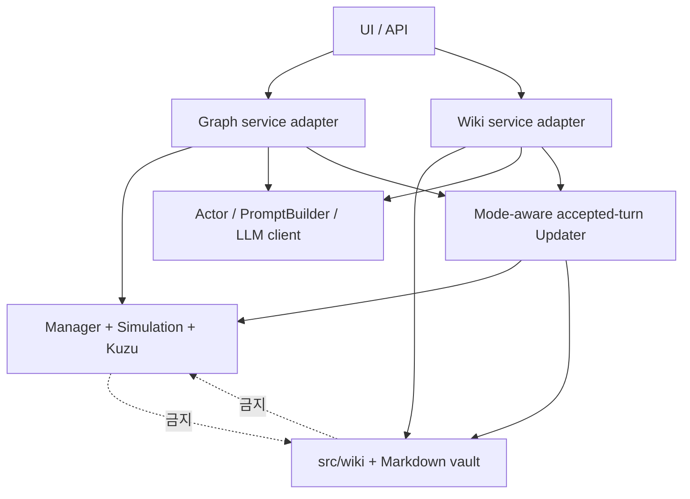

---
aliases:
  - Engine Boundaries
tags:
  - architecture
  - boundary
---

# 엔진 경계

GraphRAG와 WikiRAG는 하나의 UI와 Actor 기반을 공유하지만 서로 다른 제품 상태 모델이다.

## 공유해도 되는 계층

- FastAPI의 일반 대화 route와 NDJSON transport
- `ConversationState`의 메시지, 제목, Actor 모델 같은 UI metadata
- provider-agnostic Actor streaming
- output guard와 선택적 repair
- Fixed/Genre/Dynamic이라는 PromptBuilder 출력 계약
- `mode=graph|wiki`를 받는 accepted-turn Updater 공개 계약
- mode를 포함한 world별 usernote 저장 규칙

## 공유하면 안 되는 상태

| GraphRAG | WikiRAG | 금지 이유 |
| --- | --- | --- |
| Kuzu node/relationship | Markdown section | 서로 다른 canonical source |
| `PendingCommit` | `commit.md` | apply와 rollback 의미가 다름 |
| Graph schema ID | Wiki document ID | namespace와 lifecycle이 다름 |
| Graph memory/secret query | Wiki visibility/search | 권한 판정 방식이 다름 |
| Graph World Editor source | Wiki vault document | 저장·충돌 계약이 다름 |

## 의존성 방향

WikiRAG는 기존 `PromptBuilder`를 adapter로 재사용할 수 있지만 Manager나 Kuzu query 결과를 요구해서는 안 된다. GraphRAG 역시 `wiki_v2/` 문서를 fallback 상태로 읽지 않는다.

공용 Updater는 mode 분기와 요청·결과 계약만 소유한다. `mode=wiki`에서는 Graph
반영기를 import하거나 Kuzu를 열지 않으며 Wiki commit planner만 호출한다.
저장소별 적용 로직은 공용 진입점 뒤에 두되 같은 역할의 `graph_updater.py`와
`wiki_updater.py`를 병렬로 만들지 않는다.

## 세 종류의 Markdown

| 위치 | 목적 | 런타임 상태 여부 |
| --- | --- | --- |
| `src/agents/prompt_factory/prompts/` | 공용 프롬프트 규칙 | 상태 아님 |
| `wiki_v2/` | WikiRAG world/thread 원본 | 상태 원본 |
| `architecture_wiki/` | 사람이 읽는 설계 Obsidian vault | 상태 아님 |

이 구분이 깨지면 개발 문서가 Actor에게 노출되거나 플레이 데이터가 설계 문서와 함께 수정될 수 있다.

## 변경 검토 질문

- 이 데이터의 canonical source는 Kuzu인가 Markdown인가?
- 같은 이름의 world가 다른 mode에 있을 때 격리되는가?
- 이 write를 reroll할 때 어느 commit 모델이 책임지는가?
- Fixed에 현재 상태가 들어가 cache 안정성을 깨지 않는가?
- UI가 simulation 규칙을 대신 결정하고 있지 않은가?
