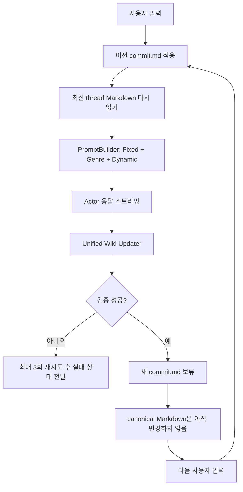

---
aliases:
  - Wiki V2 Architecture
  - Markdown Engine Architecture
tags:
  - architecture
  - wikirag
  - markdown
---

# WikiRAG

WikiRAG는 `graphRAG/wiki` 브랜치에서 개발 중인 Kuzu 없는 Markdown 원본 엔진이다. 이 문서는 아키텍처 설명이며, 실제 플레이 상태는 `wiki_v2/`에 저장된다.

## 세부 문서

- [[WikiRAG/Vault Model|vault와 문서 모델]] — world/thread, frontmatter, heading-path 주소
- [[WikiRAG/Turn Pipeline|턴 파이프라인]] — 시작 설정 물질화, Actor, 다음 턴 적용
- [[WikiRAG/Prompt Pipeline|프롬프트 파이프라인]] — Markdown에서 Fixed/Genre/Dynamic으로의 변환
- [[WikiRAG/Commit and Conflicts|커밋과 충돌 처리]] — revision, rebase, rollback, 향후 reroll
- [[Operations/Observability and Testing|관측성과 테스트]] — turn debug와 GraphRAG Chat 검증
- [[Shared/Boundaries|엔진 경계]] — 아키텍처 wiki 및 Graph 상태와의 분리

> [!warning] 이름이 비슷한 두 Wiki
> 현재 열어 본 `architecture_wiki/`는 개발 문서용 Obsidian vault다.  
> 아래에서 설명하는 `wiki_v2/`는 Actor와 Updater가 사용하는 플레이 상태 vault다.

## 책임과 경계

- Markdown 모델, parser, store, commit queue: `src/wiki/`
- Wiki 전용 채팅 조율: `src/apps/app/wiki_service.py`
- 기존 프롬프트 계약 adapter: `src/wiki/runtime.py`
- world와 thread 상태: `wiki_v2/worlds/`, `wiki_v2/threads/`
- Sites 채팅 화면: `GraphRAG Chat`
- 상세 문서 규격: `docs/wiki_v2_format.md`

WikiRAG의 정상 턴 경로는 공용 mode-aware Updater를 사용하지만 Kuzu driver,
Graph Manager와 `graph_apply.py`를 열지 않는다.

## Markdown이 유일한 원본이다

```text
wiki_v2/
├─ worlds/<world_id>/
│  ├─ world.md
│  ├─ prose.md
│  ├─ scenarios/<scenario_id>/
│  │  ├─ scenario.md
│  │  ├─ start_state.md
│  │  └─ opening_scene.md
│  ├─ characters/
│  ├─ locations/
│  └─ organizations/
└─ threads/<thread_id>/
   ├─ thread.md
   ├─ scene/current.md
   ├─ characters/
   ├─ relationships/
   ├─ events/
   ├─ memories/
   ├─ goals/
   ├─ items/
   ├─ secrets/
   ├─ commit.md
   └─ commits/
```

검색, backlink, 임베딩 같은 파생 데이터는 이후 추가하더라도 Markdown에서 재생성 가능한 cache여야 한다.

## 시나리오 3문서 계약

| 문서 | 포함하는 것 | 포함하지 않는 것 |
| --- | --- | --- |
| `scenario.md` | 해당 시나리오의 특징과 한정 묘사 규정 | 표시용 이름, 다른 시나리오, 시작 설정, 첫 장면 |
| `start_state.md` | 시작 시각·장소, 관계, 인물 상태, 첫 계기 | 완성된 첫 장면 산문 |
| `opening_scene.md` | 사용자에게 먼저 보이는 첫 장면 원문 | 장기 규칙과 별도 상태 목록 |

새 대화를 만들 때 `start_state.md`는 `threads/<thread_id>/scene/current.md`로 물질화된다. `opening_scene.md`는 상태 문서로 합치지 않고 최초 assistant 메시지와 첫 턴 최근 문맥으로 사용한다.

## 제목이 수정 주소다

- `#`: 문서 대상. patch 주소에 포함하지 않는다.
- `##`: 큰 정보 영역.
- `###`: 기본 교체 단위.
- `####`: 필요한 세부 교체 단위.

예를 들어 `## 기본 신상 > ### 나이와 생년월일`은 `("기본 신상", "나이와 생년월일")`로 식별한다. 현재 값을 제목에 쓰지 않아 값이 바뀌어도 주소가 유지되게 한다.

문서 revision과 대상 section revision은 UTF-8 내용의 SHA-256으로 계산한다. Obsidian 저장은 별도 revision 필드를 갱신하지 않아도 즉시 새로운 상태로 인식된다.

## 턴 수명주기



Actor 응답 직후 canonical 문서를 수정하지 않는 이유는 reroll과 사용자 수정의 안전성을 보존하기 위해서다.

## PromptBuilder 연결

| 구간 | WikiRAG 입력 |
| --- | --- |
| Fixed | `world_lore`에는 world·장소·조직·선택 상황·캐릭터 정적 정보, 전용 prose 슬롯에는 `prose.md` 1회 |
| Genre | 기존 prompt factory의 장면별 규칙과 checklist |
| Dynamic | `scene/current.md`, 캐릭터 현재 상태, 최근 응답, OOC, 사용자 입력 |

매 턴 파일을 다시 읽기 때문에 Obsidian에서 저장한 변경은 앱 재시작 없이 다음 Actor prompt에 반영된다. 현재 구현은 파일 변경 이벤트를 UI에 보내지는 않으며, **다음 턴 재조회**로 최신성을 확보한다.

## Updater와 지연 커밋

Updater에는 선택된 thread 문서 전문, 사용자 입력, 수락된 Actor 응답, 각 revision을 준다. 모델은 문서 전체가 아니라 `SectionPatch` 목록만 반환한다.

검증 항목:

- 제공된 문서 경로만 수정하는가
- 존재하는 제목 경로인가
- base revision이 일치하는가
- 근거가 비어 있지 않은가
- confidence가 최소 기준을 넘는가
- 같은 섹션을 중복 patch하지 않는가

다른 섹션만 사용자가 수정했다면 section revision을 이용해 rebase한다. 같은 섹션이 수정되었다면 사용자 내용을 덮지 않고 충돌로 남긴다.

## 현재 구현된 범위

- Markdown/frontmatter parser와 15종 템플릿
- world/thread scaffold와 경로 안전성
- section patch와 문서·섹션 revision 검증
- 다중 문서 논리 적용과 실패 시 rollback
- Gemini Pro updater 재시도
- `commit.md` 보류와 다음 턴 적용·archive
- 기존 `PromptBuilder`와 Actor streaming 연결
- 최신 미반영 응답의 reroll, 사용자/응답 edit, variant 선택과 delete
- commit 상태 조회, 즉시 반영, 재시도와 건너뛰기 백엔드 제어
- `babe_university` 5개 시나리오
- Graph/Wiki 대화와 usernote namespace 분리
- `GraphRAG Chat`을 통한 실제 LLM 테스트 경로

## 아직 없는 범위

- 적용된 과거 commit의 inverse patch, 3-way merge와 사용자 선택 복구
- 파일 watcher와 변경 알림 stream
- ID, link, backlink, 전문·임베딩 검색 index
- Actor별 private memory와 secret 권한
- Markdown World Editor와 Wiki Explorer
- commit diff와 수동 편집 이력
- Event·Memory·Goal·Item·Secret 신규 문서 생성을 위한 `CreateDocument`
- needs, schedule, social, reputation, personality 등 Graph 장기 시스템 parity
- 장기 플레이 품질·비용 측정
- 독립 저장소 승격

구현 우선순위는 [[TODO#WikiRAG 다음 마일스톤]]에서 관리한다.
