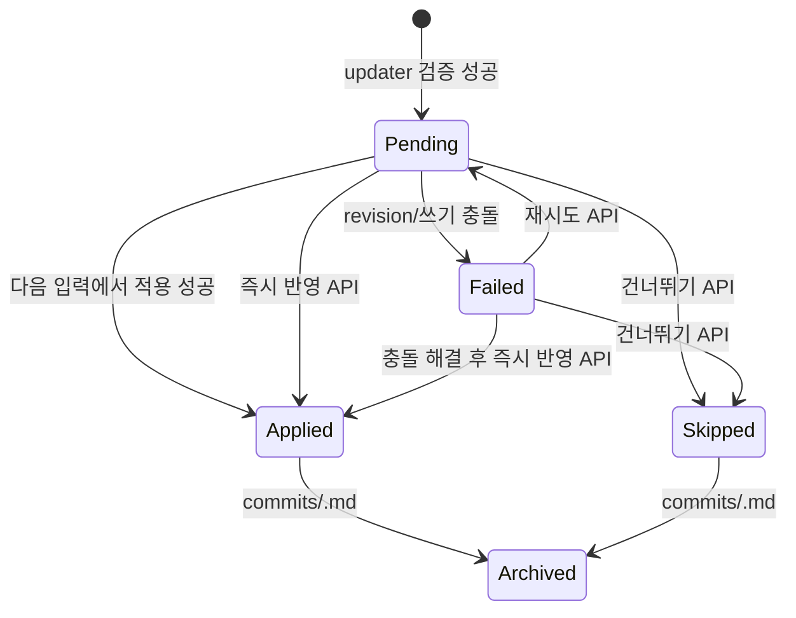

---
aliases:
  - WikiRAG Commit and Conflicts
tags:
  - architecture
  - wikirag
  - commit
---

# WikiRAG 커밋과 충돌 처리

## Updater 출력

`SectionPatch`는 다음 정보를 가진다.

- 대상 document path
- 읽을 당시 document revision
- 대상 heading path
- 대상 section revision
- 교체할 Markdown
- `evidence_source` (`player_input` 또는 `actor_response`)
- 선택한 원문에서 그대로 복사한 evidence와 confidence

## Updater 생성 정책

검증을 통과하지 못한 결과는 재시도하며, 모든 시도가 실패하면 적용 가능한
`commit.md`를 만들지 않는다. 두 번째 시도부터는 지금까지 발생한 모든 JSON 파싱
또는 정책 검증의 거부 사유를 누적해 모델에 전달한다. 이후 시도는 직전 오류만
고치면서 앞서 해결한 위치 중복·exact quote·section 범위 오류를 다시 만들 수 없다.

| 대상 | 허용되는 근거와 수정 범위 |
| --- | --- |
| 플레이어 캐릭터 | 사용자 입력만 근거로 `현재 상태` 수정 |
| Actor 캐릭터 | 수락된 Actor 응답을 근거로 `현재 상태` 수정 |
| `scene/current.md` | 현재 장면 H2 전체를 한 patch로 교체. Actor 근거와 사용자 입력의 관찰 가능한 플레이어 사실이 함께 필요하면 별도 `player_evidence` exact quote 사용 |
| 활성 인물의 위치·활동 | 캐릭터 문서에 복제하지 않고 현재 장면이 정본 |
| Actor-owner 관계 | accepted Actor 응답만 근거로 `Relationship Development` H2 전체를 교체하되 기존 durable bullet은 보존 |
| `욕구와 컨디션` | gameplay 모델 출력은 거부하고 accepted header 경과 시간으로 결정적 갱신 |
| 성격 변화·생식 상태 | gameplay 모델 출력은 거부하고 기본-off postprocessor가 전용 동적 section만 수정 |
| 캐릭터 정적 프로필 | gameplay Updater에서 수정 금지 |
| `thread.md` | 수정 금지 |

제안, 질문, 목적지 언급은 플레이어가 실제로 이동·수락·완료했다는 근거가 아니다.
Actor가 생성한 플레이어 행동은 플레이어 상태 patch의 근거로 사용할 수 없다.
NPC 행동의 대상이나 기준점으로 플레이어 이름이 등장하는 것은 허용하되, 플레이어가
문장의 주체가 되어 새 행동·감정·이동을 수행하면 거부한다. `함께 가자고 요구했다`는
제안이고, `함께 걸어갔다`는 공동 이동이므로 서로 다르게 판정한다.
단, complete 현재 장면 H2 하나에 Actor 응답의 NPC·환경 결과와 사용자 입력에
명시된 플레이어 행동을 함께 써야 할 때는 scene patch에만 `player_evidence`를
허용한다. 이 값은 사용자 입력의 exact quote여야 하며 감정·동의·믿음·욕구나
관계 입장을 추론하는 권한을 주지 않는다.
장면은 시각·장소·인물 배치·진행 중 행동·즉시 긴장이 서로 맞도록 전체를
교체하므로 일부 하위 섹션만 앞서가며 생기는 내부 모순을 차단한다.
모델이 `현재 장면`과 legacy `시작 기준`을 혼동해도 실제 문서에 둘 중 하나만
존재하면 section path와 replacement 첫 제목을 실제 제목으로 정규화한다.

관계 문서는 Graph의 숫자 affinity/trust를 저장하지 않는다. 현재 Actor가 owner인
방향성 문서에 고백, 배신, 구조, 화해, 합의된 약속, 중대한 경계 변화처럼 이후
선택을 바꾸는 변화만 영어 bullet로 누적한다. 첫 변화에서는 empty sentinel을
제거할 수 있지만, 이미 수락된 bullet은 삭제하거나 의역할 수 없다. 일상적 친절,
근접, 당황, 매력, 순응, 흥분과 친밀 행위만으로는 관계 변화를 만들지 않는다.
Actor 근거로 플레이어의 행동·동의·감정·믿음·욕구·관계 입장을 확정하면 거부한다.

## Accepted 헤더 동기화

모델 patch 검증이 끝난 뒤 수락된 Actor 산문의 첫 굵은 헤더를 결정적 규칙으로
다시 검사한다. 같은 날짜의 시간 전진은 허용하지만 시간 역행은 무시한다. 날짜가
바뀌는 헤더는 사용자 입력에 `다음날`, `내일`, `며칠 후`처럼 명시적인 시간 점프가
있을 때만 허용한다. 장소는 현재 장소와 같거나, 새 장소명이 사용자 입력에 구체적으로
등장한 경우에만 바꾼다.

허용된 시각·장소는 기존 scene patch의 `Time and Place` 하위 섹션에 병합한다.
Updater가 scene patch를 만들지 않았더라도 실제 값이 바뀌면 현재 장면 H2 전체를
대상으로 하는 결정적 patch를 추가한다. 허용된 값이 현재 정본과 같으면 표기 형식만
바꾸는 commit은 만들지 않는다.

같은 accepted header의 경과 분은 Actor-owner 캐릭터의 `욕구와 컨디션`에 저장된
6개 canonical need 수치에 Graph의 기본 증가율로 반영한다. safety는 명시적 사건
없이 자동 증가시키지 않는다. 이 patch는 일반 Updater가 만든 같은 section 출력을
대체하므로 시간 경과가 모델 판단에 따라 달라지지 않는다. 결정적 갱신은 Needs와
pressure만 다시 계산하고 작성자가 적은 `Condition` 서술은 그대로 보존한다.

## 새 Event와 Memory 문서

Updater는 나중 선택·접근·의무·갈등·공유 지식에 영향을 주는 durable Event만
구조화된 `CreateDocument`로 요청할 수 있다. 런타임은 임의 Markdown을 그대로
쓰지 않고 event template으로 canonical 문서를 렌더링한다. Event ID는
`event:<stable-ascii-slug>`, 경로는 `events/<slug>.md`로 결정하며 기존 ID와
경로를 덮어쓰지 않는다. 근거는 사용자 입력 또는 accepted Actor 응답의 exact
quote여야 하고, Actor 근거로 플레이어 행동을 확정할 수 없다.

새 문서는 section patch와 같은 `commit.md`에 보류된다. 적용할 때 exact content가
이미 있으면 crash recovery로 간주하고, 다른 내용이 있으면 충돌로 중단한다.
Applied archive는 생성 원문과 revision을 보존한다. Inverse는 문서가 그대로일 때만
삭제하며 수동 편집되었으면 아무것도 쓰지 않고 conflict를 반환한다. 삭제 inverse의
inverse는 보존된 원문을 다시 생성하므로 Actor 재생성 실패의 보상 복구에도 참여한다.

Memory도 같은 생성·적용·inverse 계약을 사용하지만 권한이 더 좁다. Actor 응답은
현재 Actor profile owner의 Memory만, player 입력은 player profile owner의
Memory만 만들 수 있다. 다른 인물의 내면 기억을 현재 턴에서 대신 생성하지 않는다.
`related_event_id`는 기존 Event 또는 같은 결과에서 생성되는 Event여야 한다.
Memory는 객관적 사건 복사본이 아니라 owner의 기억 내용·해석·감정·확신·왜곡
가능성을 따로 보존한다. 내부 Event ID는 검증에만 사용하고 Actor-visible 본문에는
Event 제목을 기록한다.

## 선택적 장기 시스템

기본-off gate를 켠 경우에도 별도 Wiki Updater 진입점을 만들지 않는다. 공용
`update_accepted_turn(mode="wiki")`가 정상 Updater 결과를 검증한 뒤 같은 pending에
추가 patch/creation을 병합한다.

gate는 두 단계로 해석한다. `src/config.py`의 환경 변수가 기본값이고, 대화별
override가 있으면 그 값이 이긴다. 대화에는 명시적으로 설정한 키만 저장하므로
건드리지 않은 시스템은 계속 환경 기본값을 따라간다. `GET`/`PATCH
/api/conversations/{thread_id}/wiki/systems`가 유효값·기본값·override 목록을
반환하며, `PATCH`에 `null`을 보내면 override를 지워 기본값 추적으로 되돌린다.
환경 접근은 `src/config.py`에만 남는다.

생식 상태는 이 실행 gate와 캐릭터 문서의 작성자 opt-in이 모두 켜져야 동작한다.
gate만 켜고 캐릭터가 `Menstrual cycle: disabled`이면 아무 일도 일어나지 않으므로,
systems 응답은 현재 thread에서 opt-in된 캐릭터 이름을 함께 반환한다.

- Memory 왜곡은 durable relationship patch가 있는 턴만 실행하며 기억의 사실 section이
  아니라 해석·감정 section만 바꾼다.
- Gossip은 같은 pending에 새로 생긴 Event의 명시된 제3자 목격자만 owner로 하는
  주관적 Memory를 만든다.
- Personality drift는 정적 성격을 덮지 않고 Actor character의
  `Personality Change Ledger`에 durable Event/관계 근거 bullet만 누적한다.
- Organic state는 author가 `Menstrual cycle: enabled`로 명시한 Actor character만
  날짜 tick과 명시적·무방비 임신 위험 판정을 수행한다. 확률 roll은 commit ID와
  누적 횟수로 재현 가능하며, 임신 확정 메시지는 공용 `TurnUpdateResult.ooc_message`로
  반환한다.

각 결과의 evidence는 accepted Actor Response의 exact quote다. 추가 호출이 실패하면
정상 Updater pending은 그대로 유지하고 해당 장기 시스템 결과만 생략한다.

## Updater 진단

각 실행은 `threads/<thread_id>/debug/updater/<run>/`에 다음 자료를 남긴다.

- 시도별 실제 prompt
- 모델 원문
- JSON·정책·Markdown 검증 오류
- 모델 ID, 입력 hash, 시도 횟수와 최종 상태

모든 prompt와 응답은 `.txt`, 메타데이터는 `.json`으로 저장한다. 진단 자료에
`.md`를 사용하면 recursive vault loader가 정본 Wiki 문서로 오인할 수 있으므로
금지한다.

## Queue 상태

백엔드는 다음 Wiki 전용 제어 경로를 제공한다.

| 동작 | 경로 | 의미 |
| --- | --- | --- |
| 상태 조회 | `GET /api/conversations/{thread_id}/wiki/commit` | 대화 상태와 실제 `commit.md` payload 확인 |
| 즉시 반영 | `POST .../wiki/commit/apply` | 다음 채팅을 기다리지 않고 현재 patch 적용 |
| 재시도 | `POST .../wiki/commit/retry` | 마지막 확정 사용자/Actor 쌍과 최신 문서로 Updater 재실행 |
| 명시적 갱신 | `POST .../wiki/commit/regenerate` | 현재 변경안을 skipped 이력으로 보존하고 마지막 확정 사용자/Actor 쌍으로 새 `commit.md` 생성 |
| 건너뛰기 | `POST .../wiki/commit/skip` | 원문을 바꾸지 않고 `skipped` archive로 이동 |
| 기존 thread migration 미리보기 | `GET .../wiki/migration` | 누락된 runtime-owned 캐릭터 상태 H3와 complete-H2 patch를 쓰기 없이 확인 |
| 기존 thread migration 적용 | `POST .../wiki/migration/apply` | 사용자 승인 뒤 즉시 audited `operation: manual` commit으로 적용 |
| 외부 편집 미리보기 | `GET .../wiki/manual-audit` | baseline 밖 canonical Markdown 변경 경로를 쓰기 없이 확인 |
| 외부 편집 기록 | `POST .../wiki/manual-audit/record` | 외부 변경을 즉시 applied `operation: manual` archive로 기록 |

`commit.md`가 존재하면 파일 payload가 대화 JSON의 표시 상태보다 우선한다. 재시도는 정상 pending을 덮어쓰지 않으므로 먼저 반영하거나 건너뛰어야 한다. failed commit 재시도 시 기존 실패본은 `skipped` 이력으로 보존한다. 명시적 갱신은 누락되거나 비정상적으로 끝난 Updater를 사용자가 복구하는 경로이며, 정상 pending도 확인 후 `skipped` 이력으로 보존하고 최신 확정 턴에서 새 변경안을 만든다. Sites UI는 이 상태를 대화별로 다시 조회하고, 적용 대기·실패·적용·건너뜀 상태와 실패 사유, 변경 문서·section·근거를 표시한다. 사용자는 같은 화면에서 상태 확인, 명시적 갱신, 즉시 반영, 재시도와 건너뛰기를 실행할 수 있다.

기존 thread 상태 계약 migration은 새 대화 생성 시의 자동 물질화와 분리한다.
미리보기는 canonical Markdown을 쓰지 않으며, 적용은 모든 character의 기존
`현재 상태` H2를 보존하면서 누락된 runtime-owned H3만 덧붙인다. 기존
`commit.md`가 있거나 complete `현재 상태` H2가 없는 문서가 하나라도 있으면
부분 적용하지 않는다. 성공본은 section before/after snapshot을 가진 일반 applied
archive이므로 동일한 inverse 및 3-way 충돌 규칙으로 되돌릴 수 있다. 이는
사용자가 승인한 구조 보강은 `manual`로 기록한다.

외부 Obsidian 편집은 `.wikirag-audit-baseline.json`의 마지막 내부 인지 상태와
비교한다. Pending 적용·inverse·즉시 migration 전에 먼저 비교하고, 차이가 있으면
deterministic ID의 applied `manual` archive를 만든 뒤 baseline을 갱신한다. 같은
H2 구조의 변경은 section snapshot으로 남겨 line-based inverse/3-way merge가
가능하고, frontmatter/H1/H2 구조 변경은 문서 전체 before/after replacement
snapshot으로 남긴다. 외부 문서 생성·삭제도 기존 full-content snapshot 계약을
재사용한다. 그 다음 pending이 같은 section을 수정하려 하면 외부 편집을 덮지 않고
failed conflict가 되며, 다른 section이면 외부 변경을 보존한 채 rebase된다. 실시간
watcher/debounce는 즉시 알림을 위한 P3 편의 기능이며 턴 경계 감사와 별개다.

## Rebase 규칙

| 현재 파일 변화 | 처리 |
| --- | --- |
| document 전체가 동일 | 그대로 적용 |
| 다른 section만 변경 | 대상 section hash가 같으면 최신 document 위에 rebase |
| 대상 section 변경 | 사용자 수정을 덮지 않고 conflict |
| patch 결과가 이미 존재 | crash recovery로 중복 적용 없이 완료 간주 |

## 다중 문서 적용

모든 patch를 먼저 메모리에서 검증한 뒤 문서별로 원자 교체한다. 중간 쓰기가 실패하면 이 호출에서 이미 쓴 문서를 원래 내용으로 되돌린다. commit queue는 별도 lock으로 queue/apply를 직렬화한다.

## reroll이 어려운 이유

Actor 메시지와 Wiki commit 사이에는 명시적인 연결이 필요하다. commit이 이미 적용된 뒤 사용자가 같은 section을 수동 수정했다면 단순 inverse patch는 사용자 변경까지 지울 수 있다.

현재 정책:

1. 최신 pending commit을 유지한 채 Actor 재생성을 먼저 완료한다.
2. 재생성이 성공하면 기존 commit을 skipped 이력으로 보관하고 새 응답의 commit을 생성한다.
3. 최신 사용자 입력 수정은 연결된 응답을 재생성하고, 응답 수정·버전 선택은 현재 본문으로 Updater만 다시 실행한다.
4. 최신 메시지 삭제는 연결된 pending commit을 skipped로 보관한다.
5. 후속 턴이 없는 최신 applied 응답은 연결된 commit을 먼저 inverse한 뒤
   edit/delete/reroll/variant 교체를 수행한다. Actor 재생성이 실패하면 생성된
   inverse commit을 다시 inverse해 원래 정본을 복구한다.
6. 후속 턴이 있는 중간 과거 메시지는 원본에서 직접 바꾸지 않는다. `여기서 분기`는
   thread vault와 commit 이력을 새 ID로 복사하고, 선택한 사용자 입력 이후의
   applied commit을 복사본에서 역순 inverse해 턴 직전 정본을 만든다.
   원본 대화와 원본 Markdown은 쓰지 않으며 선택 입력은 새 대화의 초안으로 반환한다.
7. 새 commit의 각 patch는 계획 시점의 `base_markdown`을 보관하고, 적용 archive는
   `applied_changes`에 section별 before/after 원문과 SHA-256을 기록한다.

Inverse와 수동 수정 보존 규칙:

1. 현재 section hash가 archive의 `after_revision`과 같으면 수동 수정이 없으므로
   `before_markdown`으로 되돌릴 수 있다.
2. 현재 section hash가 `before_revision`과 같으면 이미 되돌린 상태로 간주한다.
3. 둘 다 아니면 `after_markdown`을 base, `before_markdown`을 inverse 목표,
   현재 section을 사용자 편집본으로 삼아 3-way merge한다.
4. 서로 다른 줄의 변경만 자동 합치고 같은 줄이나 제목 구조가 겹치면 충돌로
   중단한다. 현재 문서는 그대로 둔다.
5. 충돌 UI는 현재 유지 또는 충돌 없는 inverse 적용을 사용자가 명시적으로
   선택하게 한다. 과거 대화 흐름을 바꾸려면 메시지 메뉴의 안전 분기를 사용한다.

현재 구현은 line-based 3-way 판정을 사용한다. 겹치지 않는 수동 편집은 보존한
inverse patch를 새 `operation: inverse` commit으로 적용한다. 같은 줄 변경,
section 삭제 또는 제목 구조 충돌은 원문을 쓰지 않고 before/current 비교 payload를
반환한다. Sites의 `Wiki 상태 검토`는 적용 가능 여부와 충돌 section을 보여주고,
사용자가 현재 상태를 유지하거나 충돌 없는 상태 inverse를 명시적으로 실행하게 한다.

새 commit은 `user_message_id`와 `assistant_message_id`를 archive에 기록하고
assistant 메시지는 `wiki_commit_id`를 보존한다. 표식 도입 전 archive는 내용
hash로 한 번 찾을 수 있지만 `applied_changes`가 없으면 자동 inverse 대상이 아니다.
중간 과거 턴의 in-place 수정은 계속 거부한다. 대신 안전 분기는 source vault를
복사한 뒤 메시지-linked applied commit만 역순으로 되돌리고, `commit.md`·lock·debug는
복사하지 않는다. 복구 중 수동 편집 충돌이 발견되면 새 branch를 제거하고 원본을
그대로 유지한다. 새 canonical frontmatter와 runtime marker의 thread ID는 branch
ID로 바꾸되 복사된 commit archive는 source provenance로 보존한다.
Source scene 불변, 선택 턴 직전 section 복원, thread ID 재소유, archive 누락 시
원자 중단은 runtime smoke로 고정한다.

이 작업은 [[TODO#P1 — 대화 변경 안전성]]에서 추적한다.
