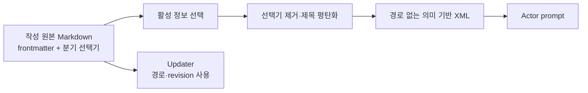

---
aliases:
  - WikiRAG Prompt Pipeline
tags:
  - architecture
  - wikirag
  - prompt
---

# WikiRAG 프롬프트 파이프라인

## Adapter의 목적

WikiRAG는 기존 PromptBuilder를 복제하지 않는다. `src/wiki/runtime.py`가 Markdown 문서를 PromptBuilder가 기대하는 world config와 rendered context로 변환하고, `src/wiki/prompt_contract.py`가 Actor 노출과 세그먼트 계약을 검증한다.

이 Adapter는 저장 문서를 그대로 직렬화하는 통로가 아니라 **Actor용 컴파일 경계**다. 경로, frontmatter ID, world/scenario/thread 식별자와 작성용 분기 제목은 저장소 내부에만 남긴다. Actor는 선택 결과인 자연어 Markdown을 의미 기반 XML 태그 안에서만 받는다.

Actor용 XML에는 `path` 속성을 넣지 않는다. `thread.md`는 대화 관리용이므로 Actor 컨텍스트에서 제외한다. 현재 장면의 H1도 `# 현재 장면`처럼 의미만 남기며 내부 식별자를 넣지 않는다.

## 컴파일 계약

Actor-visible Wiki 문서는 조립 전에 독립 prompt 모듈로 검사한다. 본문에
`[[wikilink]]`, Markdown 파일명 또는 frontmatter 필드가 남아 있으면 prompt
생성을 중단한다. 런타임은 wikilink를 따라가며 숨은 문서를 자동으로 가져오지
않는다. 필요한 사실은 해당 본문에 명시하고, 저작용 링크는 컴파일 전에
해결하거나 제거한다.

조립 뒤에는 다음 경계를 다시 검사한다.

- Fixed는 비어 있지 않으며 `world_specific_prose_prompt`와 그 안의
  `prose_rules`를 정확히 한 번 포함한다.
- Dynamic은 비어 있지 않으며 `current_scene`과 `user_input`을 정확히 한 번
  포함한다.
- `current_*` 상태는 Fixed와 Genre에 들어가지 않는다.
- 작품별 prose 규칙은 Genre나 Dynamic으로 이동하지 않는다.

`tests/smoke_wiki_runtime.py`는 현재 다섯 시나리오의 Fixed/Genre/Dynamic
SHA-256 snapshot을 고정한다. 같은 일상 장면에서 사용자 입력과 최근 서사가
바뀌어도 Fixed와 Genre는 유지되고 Dynamic만 바뀌는지도 함께 검사한다.

## Fixed

입력:

- `world_lore`: `world.md`, 공통 장소·조직, 선택된 관계·사건 정보, thread character의 정적 section
- `world_specific_prose_prompt`: `prose.md`

제외:

- 현재 장면
- 캐릭터의 `현재 상태`
- 최근 응답과 사용자 입력
- 선택되지 않은 관계·사건 정보
- `thread.md` 관리 정보
- 파일 경로, revision과 내부 ID

`prose.md`는 PromptBuilder의 전용 prose 슬롯에 정확히 한 번만 들어간다.
`world_lore` 안에 다시 복제하지 않는다. 공용 `CORE`, `POV`, `EMOTION`,
`STYLE`, `NPC_BEHAVIOR`가 담당하는 출력 언어·제한 시점·감정 증거·물리
연속성·관계 변화·열린 종결 규정도 world prose에서 반복하지 않는다.

## 정적 문서의 정본 책임

| 문서 | 정본으로 소유하는 정보 |
| --- | --- |
| `world.md` | 도시 규모, 교통 체계, 경제·기술·계절·제도·현실 법칙 |
| `locations/*.md` | 공간 구조, 위치 관계, 감각적 특징과 이용 제약 |
| `organizations/*.md` | 기관 목적, 운영 리듬, 역할, 문화와 구성원 |
| `prose.md` | 해당 작품에서만 달라지는 장르 감각·대화 관습·생활 장면 작법 |
| `scenario.md` | 현재 관계와 사건에만 적용되는 사실·톤·묘사 규정 |
| `scenes/*.md` | 해당 장면 종류에서만 달라지는 진행 순서·감각 초점·물리·대화·리듬 제약 |

한 사실을 요약본과 상세본으로 여러 문서에 반복하지 않는다. 장면 종결, 범용
POV, 감정 표시, NPC 주체성과 친밀 장면의 공통 계약은 PromptBuilder가 소유한다.

## Genre

기존 prompt factory의 공용 문체 규칙과 checklist를 사용한다. Wiki 턴은 Graph와
같은 `classifier.classify_scene_types` 공개 경로를 사용한다. 명시적 친밀 입력은
결정적 shortcut으로 처리하고, 일반 입력은 scene-only classifier로 `daily`,
`bonding`, `intimate`, `formal`, `tense`, `conflict`, `vulnerable`, `action`,
`ambient` 중 하나 이상을 고른다.

Prompt 조립 전에는 실제 asset이 있는 8개 key로 정규화한다. `vulnerable`과 legacy
`emotional`은 `bonding`, `physical`은 `action`, `workplace`는 `formal`로 연결한다.
`daily`, `bonding`, `formal`, `tense`, `conflict`, `action`, `ambient`의 과거
0-byte asset은 장면 목표, 연속성, 과잉 전개 방지, 열린 종결 규칙을 가진 공용
Markdown으로 채웠다. `intimate`는 기존 전용 Genre overlay도 함께 사용한다.

Wiki 월드는 `worlds/<world_id>/scenes/<scene_type>.md`로 월드 공통 장면 규정을,
`scenarios/<scenario_id>/scenes/<scene_type>.md`로 선택 상황 전용 override를 둘 수
있다. 같은 key는 시나리오 문서가 월드 문서를 교체하며 둘 다 없을 때만 공용
PromptBuilder asset으로 fallback한다. 각 문서의 `description`은 공용 분류 목록에
합쳐지므로 `altered`처럼 Wiki 월드만 가진 key도 분류 대상이 된다.

분류와 선택에 쓰인 경로, ID, `scene_type`, `description`은 prompt에 넣지 않는다.
활성 key의 독립 Markdown 본문만 Dynamic XML wrapper 안에 들어가며, 비활성 문서와
같은 key의 가려진 월드 문서는 읽기 결과에 포함되지 않는다.

## Dynamic

순서:

1. 현재 header와 선택된 Wiki world/scenario scene-specific prompt. 없으면 공용 prompt
2. 현재 `scene/current.md`
3. thread character의 `현재 상태`. `Reproductive State`는 이 블록에서 통째로 제거한다. 주기 정보는 활성 Actor 캐릭터의 정본에서 뽑아 공용 checklist의 `CYCLE:` 한 줄로만 전달하며, 정수 대신 국면과 `pregnancy_risk`만 노출한다(Graph와 동일한 `_cycle_status` 경로를 재사용하고 국면·임신 단계 표를 복제하지 않는다). 정본과 `updater_documents`는 손대지 않는다
4. actor visibility를 가진 기타 상태 문서. Memory·Relationship·Goal·Item은 `owner`가 현재 Actor profile과 일치하고, Secret은 현재 Actor가 owner 또는 knower인 문서만 포함
5. 최근 Actor 응답
6. usernote와 OOC
7. 현재 사용자 입력

## Visibility

Frontmatter에 `actor`가 없는 문서는 prompt에서 제외한다. Memory와 Relationship은
추가로 `owner == 현재 NPC profile_id`를 만족해야 하므로 player나 다른 NPC의
주관적 기억·관계 관점이 현재 Actor prompt에 들어가지 않는다. Updater는 owner별
상태를 검증해야 하므로 모든 Memory·Relationship 전문과 frontmatter를 계속
받는다. Goal과 Item도 같은 owner 경계를 사용한다. Secret은 template 자체는
Actor-visible이지만 현재 Actor profile이 `owner` 또는 frontmatter `knowers`에
있을 때만 본문을 포함한다. 알려진 Secret이 `hidden` 또는 `suspected`이면 Actor는
그 사실을 행동 판단에는 사용하되 독자 설명으로 공개하지 않고, 본문에 이미 확정된
공개 단서만 드러낸다. `revealed` 뒤에만 실제 내용을 공개적으로 말할 수 있다.
생성 뒤에는 모든 hidden/suspected Secret의 실제 내용과 normalized/token 중첩을
가시 산문에서 다시 검사한다. 누설은 output repair 대상으로 보내고, 수정 뒤에도
남거나 repair가 꺼져 있으면 private truth를 오류에 포함하지 않고 응답을 거부한다.

누적 Event·Memory·Goal·Item·Secret이 예산을 넘으면 결정적 recall이 active owner,
scene 언급과 생성 시각으로 선택한다. Actor와 Updater는 서로 다른 예산을 사용하며
짧은 thread에서는 문서를 자르지 않는다.

Dynamic character state의 `Active pressure`가 임계에 도달하면 Actor는 수치나 label을
낭독하지 않고 NPC 자신의 구체 행동·대화·물건 사용·정당한 퇴장으로 표현한다.
현재 시각과 작성된 일정이 겹칠 때도 NPC 자신의 준비·이동·연락만 만들 수 있으며
플레이어가 동행하거나 계획을 수락했다고 가정하지 않는다.

## 인물 프로필 분기

작성 원본의 한 H2 안에서 `### common`, `### default`, `### <내부 분기 ID>`를 선택기로 사용할 수 있다. `common`은 항상 포함하고, 활성 분기가 있으면 그것을 선택하며 없으면 `default`를 선택한다. 선택기 아래 실제 소제목은 H4부터 작성한다.

대화 생성 시 선택기 제목은 제거되고 실제 소제목이 한 단계 올라간다. 따라서 Actor와 이후 상태 갱신에 사용되는 인물 본문에는 `common`, `default`나 내부 분기 ID가 남지 않는다. 같은 H2 안에서 선택기 H3와 일반 H3를 섞으면 모호한 문서로 보고 초기화를 실패시킨다.

## 시작 설정 보장

새 thread의 `scene/current.md`에는 `start_state.md`의 `## 시작 기준` 이하 내용이 들어간다. 첫 턴 Dynamic prompt에는 이 scene과 `opening_scene.md`에서 온 최근 문맥이 모두 들어가야 한다.

검증 지점:

- `logs/turn_debug/<turn>/dynamic_prompt.txt`
- `logs/turn_debug/<turn>/metadata.json`
- `logs/turn_debug/<turn>/summary.md`

구체적인 점검 절차는 [[Operations/Observability and Testing|관측성과 테스트]]에서 관리한다.
