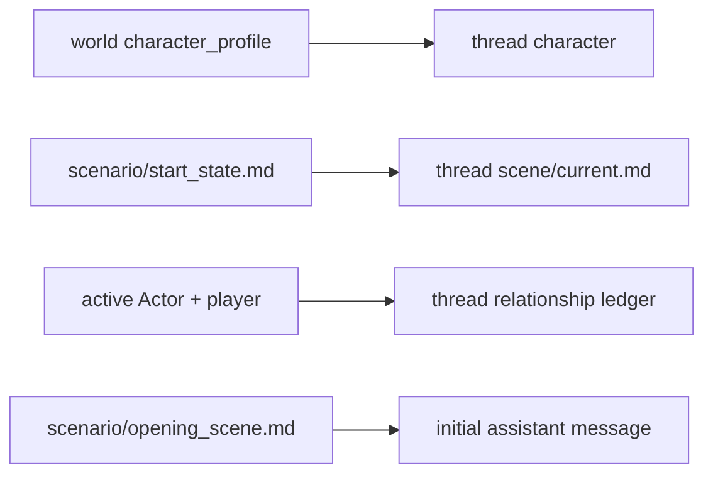

---
aliases:
  - WikiRAG Vault Model
tags:
  - architecture
  - wikirag
  - vault
---

# WikiRAG vault와 문서 모델

## 두 scope

### World scope

재사용 가능한 세계, 규칙, 시작 전 인물 프로필, 장소, 조직, 시나리오를 보관한다.

### Thread scope

한 플레이에서 변화하는 현재 장면, 캐릭터, 관계, 사건, 기억, 목표, 아이템, 비밀을 보관한다. 대화 시작 후 동적 사실의 canonical home은 thread 문서다.

동적 사실은 유형별로 다시 한 곳만 정본으로 삼는다. Scene은 공유 시각·장소·배치·
활동, Character는 개인 신체·감정·needs와 전용 원장, Relationship은 owner 방향의
durable 관계 변화, Event는 객관적 발생 사실, Memory는 owner의 주관적 기억,
Goal은 지속 목표와 진행, Item은 물품 상태·보관·접근, Secret은 비공개 진실·knower·
공개 상태를 소유한다. 같은 사실의 전문을 다른 문서에 복제하지 않고 지원되는
연결은 안정적인 ID로만 표현한다.

## 문서 종류

| 범위 | 주요 type |
| --- | --- |
| world | world, prose, scenario, character_profile, location, organization |
| thread | thread, scene, character, relationship, event, memory, goal, item, secret |

## Frontmatter 책임

Frontmatter는 안정적인 정체성과 접근 경계를 담는다.

- `id`, `type`, `schema_version`
- `visibility`
- `world_id`, `thread_id`, `profile_id`
- 필요 시 `owner`, `participants`, `created_at`
- Updater가 새로 만든 durable Event와 Memory에는 `source_commit_id`와 가능한 경우
  `source_user_message_id`, `source_assistant_message_id`

현재 시각, 위치, 감정, 관계 변화처럼 Updater가 바꾸는 값은 본문 section에 둔다.
Memory는 `owner` profile 하나의 주관적 상태다. 기본 visibility는
`[actor, updater]`이며 player에게 정본 파일을 자동 공개하지 않는다. Actor prompt
조립은 visibility만 믿지 않고 현재 NPC profile과 owner가 일치하는지도 검사한다.

Relationship도 `owner` profile이 다른 `participants` 한 명을 보는 방향성 상태다.
Graph의 affinity/trust 숫자를 복제하지 않고, 시작 이후 후속 선택을 바꾸는 durable
관계 변화만 자연어 bullet 원장으로 누적한다. 정적 시작 관계는 scenario와
`scene/current.md`가 소유하며 relationship 문서에 복제하지 않는다.

## Heading-path 주소

```text
# 진은서
## 기본 신상
### 나이와 생년월일
```

patch 주소는 `기본 신상 > 나이와 생년월일`이다. H1은 문서 대상이라 주소에서 제외한다.

### 제목 규칙

- 같은 문서 안에서 같은 전체 경로를 반복하지 않는다.
- `기타`, `정보` 같은 모호한 leaf 제목을 피한다.
- 제목에 현재 값을 넣지 않는다.
- H3을 기본 수정 단위로 사용한다.

### 설정 완결성

- Actor가 읽는 인물·세계 본문에는 `아직 정해지지 않았다`, `플레이 중 정한다`, `구체적인 값은 미정` 같은 저자용 빈칸 문장을 쓰지 않는다.
- 필요한 사실은 출생, 가족, 거주, 일정, 능력, 취향과 관계 이력처럼 장면에서 사용할 수 있는 구체적인 정보로 작성한다.
- 인물이 모르는 사실은 세계의 객관적 사실과 해당 인물의 인식 범위를 모두 적어 지식 차이로 표현한다. 세계 설정 자체를 비워 두는 방식으로 표현하지 않는다.
- 작성자가 결정할 권한이 없는 정보는 문서에 미정 문구를 저장하지 않고 사용자에게 확인한 뒤 반영한다.
- 동의나 플레이어 캐릭터 권한처럼 매 장면 달라지는 선택은 미정 설정이 아니라 명시적인 서술 경계로 작성한다.

## Materialization



profile과 start state는 새 thread 생성 시 복사되고 활성 Actor→player 관계 원장은
빠진 경우에만 생성된다. 이후 world 원본을 바꿔도 기존 thread의 동적 상태를 자동
덮어쓰지 않는다.

새 thread 물질화가 모두 끝나면 thread root에 Actor와 Updater가 읽지 않는
`.wikirag-runtime.json`을 기록한다. 이 표식은 현재 런타임에서 완성된 thread와
표식 도입 전 thread를 구분하는 진단용이며 Markdown 정본이나 prompt 입력이 아니다.
표식이 없거나 읽을 수 없거나 지원 버전과 다르면 기존 문서를 자동 마이그레이션하지
않고 `legacy`로 보고한다.

## 대화 lifecycle

대화 표시 이름과 보관 여부는 `data/threads/<thread_id>.json`의 UI 상태이며 Actor
prompt나 Wiki 정본에 들어가지 않는다. 보관은 파일을 옮기지 않고 목록에서 접어 두는
가역 상태다.

Wiki 내보내기는 대화 JSON과 `threads/<thread_id>`의 canonical Markdown 및 commit
archive를 ZIP으로 묶는다. 실행 중 lock과 `debug/` 진단 산출물은 제외한다. 영구
삭제는 검증된 thread 경로를 같은 `threads/` 아래 staging 이름으로 먼저 옮기고 대화
JSON을 삭제한 뒤 staging을 제거한다. 중간 단계가 실패하면 thread와 대화 JSON을
복구해 반쪽 삭제를 피한다.

## Revision

revision은 저장 필드가 아니라 UTF-8 전체 내용의 SHA-256이다. section revision도 해당 section Markdown의 hash다. 따라서 Obsidian의 직접 저장을 별도 API 없이 감지할 수 있다.
